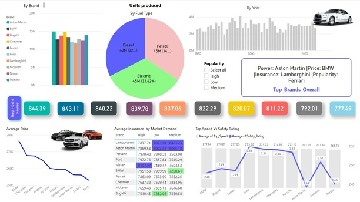
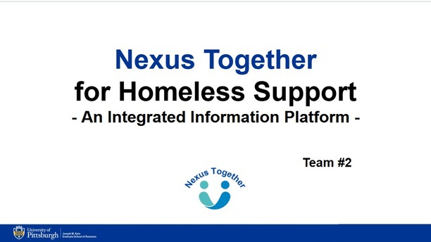

## Education

- Masters in Analytics and Information Management, Duquesne University, Pittsburgh, PA- 2025
- Certificate in Human Resources and Marketing, Dhruva College of Management, Hyderabad- 2017
- Bachelor of Technology, Electronics & Communications Engineering, Jawaharlal Nehru Technological University- 2014
  
## Technical Skills

Analytics & Data Tools	 | SQL, Python, Machine Learning, Predictive Analytics, Behavioral Analytics
HR Systems		 | Workday, Keka HR, FastCollab
Reporting & Visualization| Microsoft Excel, Power BI, Tableau, Visio
Other Tools		 | Microsoft Office (Excel, Word, PowerPoint)

## Work Experience

Advance Auto Parts India, Hyderabad | Sr. Executive HR, 11/2020- 11/2022
West Agile Labs, Hyderabad 	    |People & Culture Executive, 4/2019 – 10/2020
WHISHWORKS IT Consulting Pvt.Ltd., Hyderabad |Talent Executive 3/2017 –4/2019
Dabur India Pvt. Ltd., Hyderabad | Intern 5/2017 - 8/2017

## Professional Highlights
-Designed and maintained dashboards, transforming raw data into actionable insights

-Partnered with leadership to define key business KPIs, driving data-backed decision-making

-Implemented enterprise-wide systems, enhancing process efficiency and data integration

-Conducted data analysis to identify trends, optimize operations, and improve outcomes

-Applied analytics to enhance process efficiency and user experience

-Led data-driven process optimization initiatives, ensuring accuracy and consistency

-Utilized data storytelling techniques to communicate insights to diverse stakeholders

-Played a key role in change management, facilitating smooth transitions and adoption of new processes

-Recognized for implementing best practices

-Enhanced onboarding efficiency using data-driven insights, improving new hire integration

-Led Several CSR Activities

## Projects 

### People BI Dashboard

This Power BI dashboard offers workforce insights through risk scoring, attrition analysis, and performance tracking. It helps HR teams identify high-risk employees, evaluate training effectiveness, and improve engagement. Key metrics include workforce distribution, satisfaction trends, and termination reasons. Designed for real-time decision-making and HR analytics improvements.

### Luxury Cars - BI Dashboard

This Power BI dashboard provides a comprehensive analysis of elite sports car brands, offering insights into various performance, pricing, and market demand metrics. Key features include:

-Production Analysis: Breakdown of units produced by fuel type over time.
-Brand Performance: Average horsepower, insurance cost, and pricing comparison across brands.
-Market Demand & Popularity: Identification of top brands based on high-demand models.
-Safety vs. Speed Correlation: Understanding how top speed relates to safety ratings.
-Top Brands Overview: Dynamic identification of best-performing brands in key categories like power, price, insurance cost, and popularity using DAX measures.

### Healthcare for the Homeless

The project focused on creating an integrated platform to bridge the gap between service providers and the homeless population, improving access to essential resources. We identified the communication barriers among service providers and addressed them through better coordination. A predictive model was implemented to optimize the placement of kiosks that share nearby resource information. This initiative aimed to enhance accessibility and support for the homeless community.

### Unbanked and Underbanked in the US

Analyzed the evolving landscape of community banking in the U.S. Examined historical impacts, demographic shifts, and challenges faced by unbanked and underbanked populations. This project focuses on AI-driven strategies to enhance financial accessibility, reduce banking deserts, and promote digital transactions in underserved communities. 

### Play Store App Performance

This project predicts the performance of Playstore apps using machine learning. It uses a dataset from Kaggle with information on over 10,000 apps, including attributes like reviews, size, installs, and ratings. Data cleaning and preprocessing involved handling missing values, converting columns to appropriate data types, and encoding categorical variables. Three models were used: Linear Regression, Random Forest, and PCA with Logistic Regression. Random Forest outperformed Linear Regression, but the models still showed room for improvement, suggesting further feature exploration or alternative models for better predictions

### Recruitment and Selection 

This project focuses on comparing recruitment and selection strategies of five major FMCG companies in India. It examines key recruitment sources, selection tests, hiring duration, and employee tenure. The study finds that while hiring practices are largely similar, variations exist in recruitment frequency, selection processes, and compensation. The findings offer insights into industry benchmarks and best practices for effective talent acquisition in the FMCG sector.

## Publications
Chitta. A. (2018) HR Management in 21st Century: Challenges for future. Journal of Social Welfare and Management, 10(2), 164- 166
   
